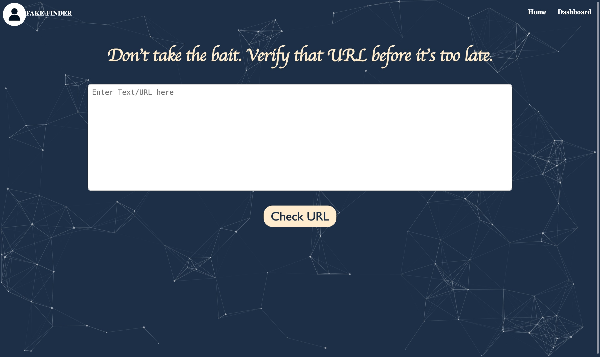
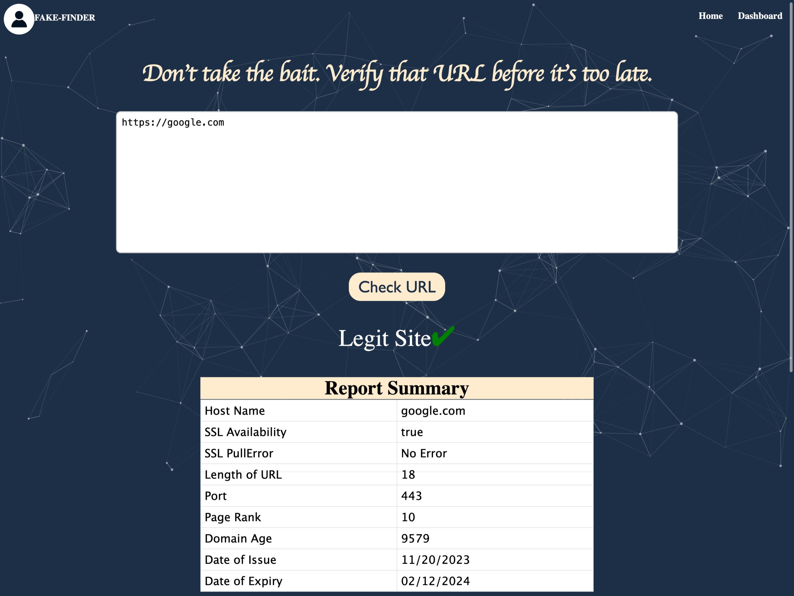
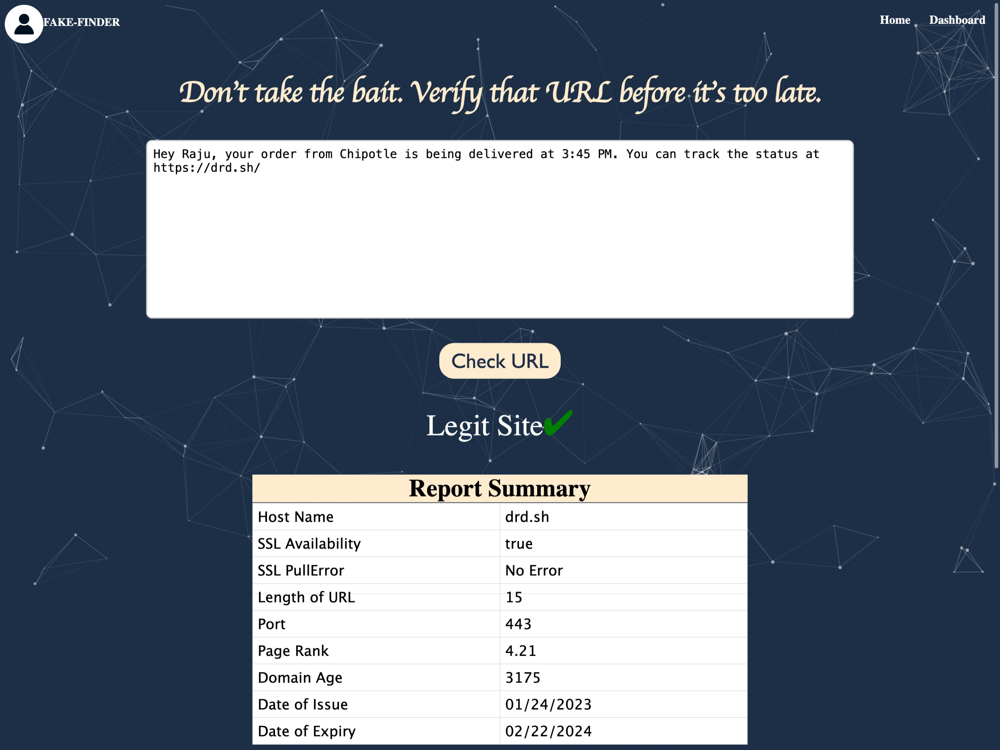
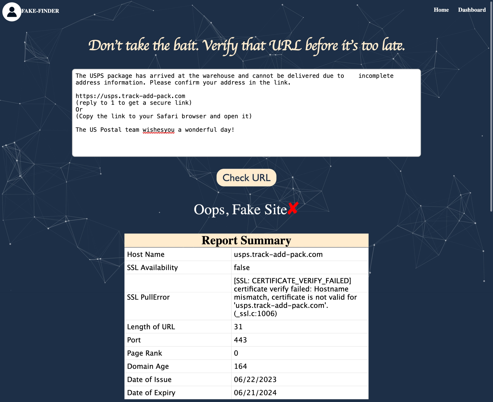

<div align="center">
<h1>URL Rakshak</h1>
<h3>A Safe URL Inspector</h3>
<a href="https://pypi.org/project/URLRakshak"></a>


<a href="https://github.com/AnushaBhavanam/SafeURLInspector_FE/blob/main/LICENSE"></a>
<a href="https://github.com/AnushaBhavanam/SafeURLInspector_FE/network"></a>
<a href="https://github.com/AnushaBhavanam/SafeURLInspector_FE/stargazers"></a>
</div>

## Introduction

- 🌐 **URL Extraction & Analysis**: Safe URL INSPECTOR excels in extracting URLs from  input message or emails, ensuring a comprehensive approach to identifying potential threats.


- 🌐 **Selenium for Real-time Analysis**: Leveraging the power of Selenium, our solution conducts real-time analysis of redirected URLs, allowing us to stay ahead of evolving counterfeit tactics.


- 🌐 **Machine Learning Classification**: A robust Random Forest machine learning model is at the core of our solution, enabling us to classify URLs with high accuracy, taking a proactive stance against the infiltration of fake URLs into the commerce stream.


- 🌐 **SSL Certificate Authentication**: Going beyond conventional methods, Safe URL INSPECTOR introduces a second layer of authentication through SSL certificates. This innovative approach enhances the reliability of our classification, distinguishing between legitimate and fake URLs.


- 🌐 **Tableau Analytics**: Our integration with Tableau provides invaluable insights, offering a visual representation of key statistics related to phishing URLs. This data empowers stakeholders with a clearer understanding of the counterfeiting landscape.


## Installation


- **Backend**
  - Via **pip**
      - First fill the variables in `sample.env` and rename it to `.env`

        ```
        wget -q https://raw.githubusercontent.com/ViswanathBalusu/SafeURLInspector/9a1b80c75579a27ca94b022f77e27453f4e18d94/sample.env 
        ```

      - Then Create a Virtual Environment (Optional but Recommended) and then install URLRakshak with

          ```
          python3 -m virtualenv venv
          source venv/bin/activate
          pip install URLRakshak
          ```
      - Then run the program with `URLRakshak` (The program by default will start on the `8080`, if you want to change it use PORT Environmental variable)
  - Via **Docker**
      - Download [sample.env](https://raw.githubusercontent.com/ViswanathBalusu/SafeURLInspector/9a1b80c75579a27ca94b022f77e27453f4e18d94/sample.env ) and Fill the Variables 
          - ```wget -q https://raw.githubusercontent.com/ViswanathBalusu/SafeURLInspector/9a1b80c75579a27ca94b022f77e27453f4e18d94/sample.env ```
      - Finally run the docker image by passing the env file from the arguments.

- **Frontend**
    - Change the Environmental Variables and start the http server by running the command `npm run serve`


## Variables in `sample.env`

|        Variable        |           Value            |            Example            | Required |                                    Description                                    |
|:----------------------:|:--------------------------:|:-----------------------------:|:--------:|:---------------------------------------------------------------------------------:|
| OPEN_PAGE_RANK_API_KEY |   Open Page rank API Key   |           xxxxxxxxx           |   True   |                             Api to get page rank from                             |
|        API_KEY         | An API Key for your Server |          URLRakshak           |   True   | This is like a Password for your API Server, So choose Wisely (Alphanumeric only) |
|         DB_URL         | Any SQL Compatible DB URL  | {PROTOCOL}://xxx:xxx@host.com |   True   |                              This can be SQLite too                               |

## Teammates

👏 [Hemanth Kumar Reddy Tiyyagura](https://www.linkedin.com/in/hemanth-tiyyagura/)

👏 [Anusha Bhavanam](https://www.linkedin.com/in/anusha-bhavanam/)

👏 [Chandra Kiran Viswanath Balusu](https://www.linkedin.com/in/ckvbalusu/)

👏 [Sampath Sai Yelleti](https://www.linkedin.com/in/sampathsaiyelleti/)

👏 [Siva Satyanarayana Raju Pusapati](https://www.linkedin.com/in/raju-pusapati/)

## Note

- A [Report](./Report.pdf) With complete info about the project is available in the repository.

<div align="center">

<h1>Screenshots</h1>
</div>













